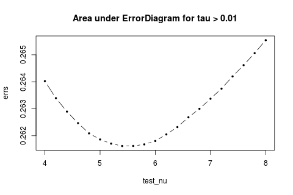
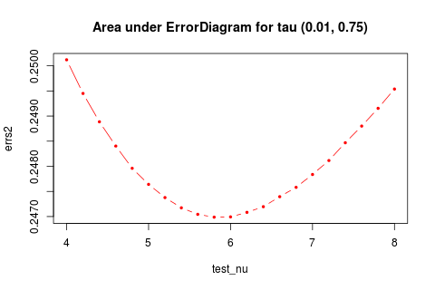
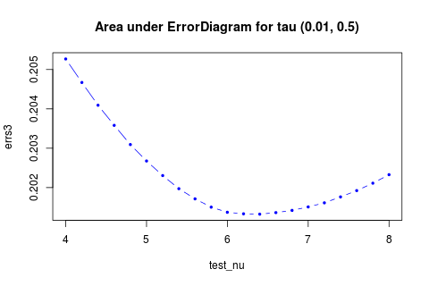
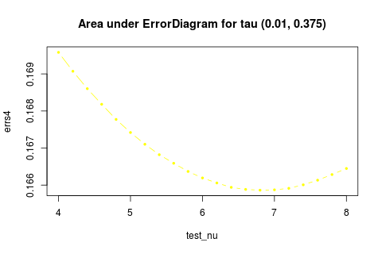
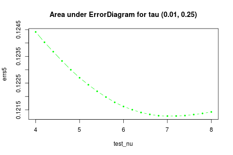
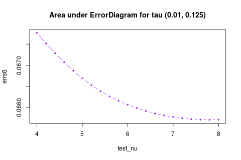

[ErrorRateFunction.R](ErrorRateFunction.R) contains the function to get tau and nu for given window size. Ussage is in the comment of the file.  
[MDAModelGetData.R](MDAModelGetData.R) tests on MDA model. It creates [MDAModel.RData](MDAModel.RData), which contains the taus and vs for different nus and ks.  
[MDAModelAnalysis.R](MDAModelAnalysis.R) contains the code for analysis on the models using [MDAModel.RData](MDAModel.RData).  

How to run the code:
--------------------
* **If you want to play around with the plots in the section below**, please download [MDAModelAnalysis.R](MDAModelAnalysis.R) and [MDAModel.RData](MDAModel.RData). Load [MDAModel.RData](MDAModel.RData) into workspace before running [MDAModelAnalysis.R](MDAModelAnalysis.R). [MDAModel.RData](MDAModel.RData) contains a list `result`. Each element is a list of `tau` and corresponding `error rate(v)` of 1000 sample point for a specific `nu`.  
* **If you want to draw Error Diagram for your own model**, you can use [MDAModel.RData](MDAModel.RData) to get each pair of `tau` and `error rate`. `get_eror_diagram` in [MDAModelGetData.R](MDAModelGetData.R) can serve as an example for creating a Error Deagram from `tau`, `error rate` pair.
* **If you want to reproduce [MDAModel.RData](MDAModel.RData) or get it for another dataset**, please download [ErrorRateFunction.R](ErrorRateFunction.R) and [MDAModelGetData.R](MDAModelGetData.R). You need to have [DataFrame.csv](https://www.dropbox.com/s/tzx4qqxhh9u9iz2/DataFrame.csv) in the same directory and `setwd("[directory]")`before running the code. It takes about an hour to run my code.  

Results for MDAModel
--------------------
 
 
 
 
 

* The best nu depends on the range of tau we look at.  
The best nu is 5.4, 5.8, 6.4, 6.8, 7, 7.8 for tau in range (0.01, 1), (0.01, 0.75), (0.01, 0.5), (0.01, 0.375), (0.01, 0.25), (0.01, 0.125) accordingly.
* The models don't actually different that much from each other. The range of error rate is less than 1%.

 

  
The reason I don't draw them together is that they are so similiar that we can only see one line if put them all together.

